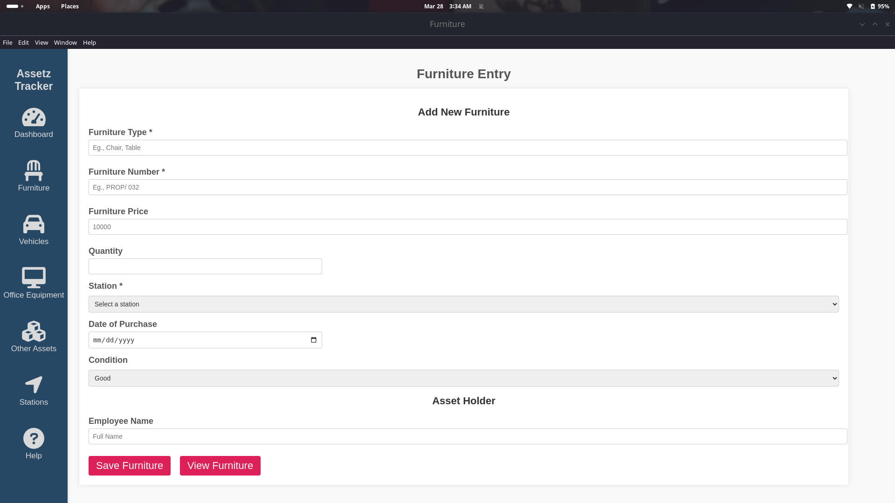

# Asset Management App

This is a desktop application built with **Electron.js** to manage and track assets efficiently. The app uses **SQLite** for storing asset data and integrates libraries like **Chart.js** and **pdf-lib** for advanced functionality.

## Screenshots
  
*Asset list view.*

  
*Adding a new asset.*

## Technologies Used
[](https://www.w3.org/html/)  [](https://www.w3.org/Style/CSS/)  [](https://www.javascript.com/)  [](https://www.electronjs.org/)  [](https://www.sqlite.org/)  [](https://www.chartjs.org/)  [](https://pdf-lib.js.org/)


## Features
- **Add/Edit/View/Delete Asset Information**: Track asset name, location, value, condition, and more.
- **Persistent Data**: Data is stored in an SQLite database and is accessible even after restarting the app.
- **User-Friendly Interface**: Simple and intuitive design for ease of use.
- **Charts**: Visualize asset data using **Chart.js**.
- **PDF Export**: Generate and download PDF reports using **pdf-lib**.

## Installation

### Prerequisites:
- Ensure **Node.js** and **npm** are installed on your system. If not, install them from [Node.js official website](https://nodejs.org/).

1. Clone or download the repository to your local machine.
2. Navigate to the project folder using your terminal/command prompt:
   ```bash
   cd your-repository-folder
